# 🌟 VIVEC Web Application

A modern, high-performance, and visually stunning web application for the **VIVEC** educational platform. Built using **React 19**, **Vite 8**, and custom styled-component aesthetics using clean **Vanilla CSS**.

---

## 🗺️ Component Architecture

The visual layout of the application is composed of highly modular, reusable React components styled with a global design system. Here is the rendering tree:

```mermaid
graph TD
    App[App.jsx] --> TopUtilityBar[TopUtilityBar.jsx]
    App --> Navbar[Navbar.jsx]
    App --> HeroSlider[HeroSlider.jsx]
    App --> CTABlocks[CTABlocks.jsx]
    App --> AboutSection[AboutSection.jsx]
    App --> WhyChooseUs[WhyChooseUs.jsx]
    App --> CourseGrid[CourseGrid.jsx]
    App --> StudyModes[StudyModes.jsx]
    App --> FeatureGrid[FeatureGrid.jsx]
    App --> Testimonials[Testimonials.jsx]
    App --> Partners[Partners.jsx]
    App --> SuccessStories[SuccessStories.jsx]
    App --> Footer[Footer.jsx]

    style App fill:#1e293b,stroke:#38bdf8,stroke-width:2px,color:#fff
    style TopUtilityBar fill:#0f172a,stroke:#334155,stroke-dasharray: 5 5,color:#fff
    style Navbar fill:#12A645,stroke:#15803d,stroke-width:2px,color:#fff
    style HeroSlider fill:#0d1b2a,stroke:#1e3a8a,color:#fff
    style CTABlocks fill:#ea580c,stroke:#c2410c,color:#fff
    style Footer fill:#0f172a,stroke:#334155,color:#fff
```



---

## 🛠️ Technology Stack

- **Framework**: [React](https://react.dev/) (v19)
- **Bundler & Local Dev Server**: [Vite](https://vitejs.dev/) (v8)
- **Styling**: Vanilla CSS (global token-based stylesheet at [src/index.css](file:///d:/Vivec_website/src/index.css))
- **Icons**: [Lucide React](https://lucide.dev/) (v1.16+)

---

## 💻 Getting Started & Local Setup

Follow these instructions to set up the project locally on your machine.

### Prerequisites

Ensure you have the following installed on your machine:
- **Node.js** (v18.0.0 or higher recommended)
- **npm** (usually comes pre-installed with Node.js)

---

### Step-by-Step Installation

1. **Clone the Repository**
   ```bash
   git clone https://github.com/SaniyaGupta05/VIVEC.git
   cd VIVEC
   ```

2. **Install Dependencies**
   Run the following command to download and install all necessary NPM packages:
   ```bash
   npm install
   ```

3. **Start the Development Server**
   Spin up the local hot-reloading development server:
   ```bash
   npm run dev
   ```
   *By default, the server runs on [http://localhost:5173](http://localhost:5173). If that port is occupied, Vite will automatically select the next available port.*

4. **Production Build**
   To compile and optimize the application files for production deployment:
   ```bash
   npm run build
   ```
   This generates optimized static files in the `/dist` directory.

5. **Preview Production Build**
   To test the production build locally before deploying:
   ```bash
   npm run preview
   ```

6. **Linter & Formatting Checks**
   Ensure code quality checks are satisfied:
   ```bash
   npm run lint
   ```

---

## 🎨 Global Design System & Variables

All visual elements, colors, and layout patterns are governed by the variables defined in [src/index.css](file:///d:/Vivec_website/src/index.css). When writing or editing component styles, please use these variables to maintain consistency:

### Brand Palette

| Variable | Hex Value | Role / Usage |
| :--- | :--- | :--- |
| `--brand-green` | `#0b7e3e` | Primary brand accent color, buttons, highlights |
| `--brand-green-dark` | `#07592b` | Button hover states, dark green highlights |
| `--brand-green-light`| `#e8f7ee` | Soft background panels |
| `--brand-orange` | `#e66e19` | Secondary accent, CTA buttons, login states |
| `--brand-orange-dark`| `#c5590f` | Hover states for secondary actions |
| `--brand-yellow` | `#f1b418` | Warning highlights and gold accents |
| `--slate-dark` | `#121c24` | Main headings, footer background, card headers |
| `--text-main` | `#334155` | Body text color |

### Typography

- **Headers & Titles**: `Outfit` font family (`--font-title`)
- **Body & Controls**: `Inter` font family (`--font-sans`)

### Animation Transitions

- `--transition-fast`: `0.2s cubic-bezier(0.4, 0, 0.2, 1)`
- `--transition-normal`: `0.3s cubic-bezier(0.4, 0, 0.2, 1)`
- `--transition-slow`: `0.5s cubic-bezier(0.4, 0, 0.2, 1)`

---

## 📂 Project Structure

```text
Vivec_website/
├── public/              # Static assets (favicons, manifest metadata)
├── src/
│   ├── assets/          # Global assets (images, logos, vectors)
│   ├── components/      # Reusable UI component modules
│   │   ├── AboutSection.jsx
│   │   ├── CTABlocks.jsx
│   │   ├── CourseGrid.jsx
│   │   ├── FeatureGrid.jsx
│   │   ├── Footer.jsx
│   │   ├── HeroSlider.jsx
│   │   ├── Navbar.jsx
│   │   ├── Partners.jsx
│   │   ├── StudyModes.jsx
│   │   ├── SuccessStories.jsx
│   │   ├── Testimonials.jsx
│   │   ├── TopUtilityBar.jsx
│   │   └── WhyChooseUs.jsx
│   ├── App.jsx          # Root rendering layout component
│   ├── App.css          # App-wide structural layout styling
│   ├── index.css        # Central Design System stylesheet (Variables, resets, layouts)
│   └── main.jsx         # React application entry point
├── eslint.config.js     # Code quality and styling linter configuration
├── vite.config.js       # Vite build configurations
└── package.json         # Scripts, configurations, and package dependencies
```

---

## ❓ Troubleshooting

> [!TIP]
> **Node Version Lock**
> If you experience installation errors or package resolution failures, ensure you are running Node.js version **18.x** or higher. Check your current version with:
> ```bash
> node -v
> ```

> [!WARNING]
> **Hot Module Replacement (HMR) Not Triggering**
> If edits do not refresh the browser instantly:
> 1. Verify you do not have multiple instances of `npm run dev` running.
> 2. Restart the Vite process (`Ctrl + C` in the terminal and run `npm run dev` again).
> 3. Clear your browser cache or open in Incognito mode to bypass local assets caching.

> [!NOTE]
> **Dependency conflicts**
> If NPM shows peer dependency warnings during install, you can clean-install dependencies using:
> ```bash
> npm ci
> ```
